# GAB Development Workflow

This diagram shows the suggested workflow for creating and refining a GAB product, starting from the initial GAB 4-mode workflow through testing and finalization.

```mermaid
flowchart TD
    Clarification[Clarification Mode 🔍] --> Discussion[Discussion Mode 💬]
    Discussion --> Formalization[Formalization Mode ✅]
    Formalization --> Generation[Generation Mode 🚀]
    Generation --> LoadActors[Load Actors<br/>load all of the actors used in the product]
    LoadActors --> SelfCheckActors[Self-Check Actors<br/>each actor reports issues with thier instrutions]
    SelfCheckActors --> UnloadActors[Unload Actors<br/>unload all the actors used in the product]
    UnloadActors --> CheckActorIssues{Is there vagueness, missing instructions, inconsistencies, or logic errors?}
    
    CheckActorIssues -->|Yes| LoadActors
    CheckActorIssues -->|No| SelfCheckNonActors[All-But-Actors Self-Check<br/>Check non-actor portions]
    
    SelfCheckNonActors --> CheckIssues{Is there vagueness, missing instructions, inconsistencies, or logic errors?}
    
    CheckIssues -->|Yes| Modify[Modify Actors and<br/>Non-Actor Portions<br/>using GAB]
    Modify --> LoadActors
    
    CheckIssues -->|No - Zero Issues| SystemTest[System-Level Test<br/>of the Product]
    
    SystemTest --> CheckStable{Is application<br/>stabilized and<br/>working as desired?}
    
    CheckStable -->|No| Modify
    CheckStable -->|Yes| Ready([Product Ready<br/>for Use])
    
    style Clarification fill:#e1f5ff
    style Discussion fill:#e1f5ff
    style Formalization fill:#e1f5ff
    style Generation fill:#e1f5ff
    style Ready fill:#d4edda
    style Modify fill:#fff3cd
    style CheckActorIssues fill:#f8d7da
    style CheckIssues fill:#f8d7da
    style CheckStable fill:#f8d7da
```

## Workflow Steps

1. **GAB 4-Mode Workflow**: Create your initial product specification using GAB's structured workflow:
   - **Clarification Mode 🔍**: Analyze requirements, identify ambiguities, ask targeted questions
   - **Discussion Mode 💬**: Decompose the problem, design architecture, propose solutions
   - **Formalization Mode ✅**: Analyze for logic errors, verify AALang compliance, check for bugs
   - **Generation Mode 🚀**: Create the final AALang product files and JSON-LD specifications

2. **Actor Self-Check Cycle**: Iterate on actors until they pass self-check:
   - **Load Actors**: Use the `load actors` command to load all actors from the generated `.jsonld` files into the GAB environment.
   - **Self-Check Actors**: Use the `self-check actors` command to have the loaded actors analyze their own instructions for issues, inconsistencies, and potential problems.
   - **Unload Actors**: Use the `unload actors` command to return to builder-only mode.
   - **Check Actor Issues**: Review the actor self-check results.
     - **If actor issues found**: Modify actors using GAB, then return to Load Actors.
     - **If no actor issues**: Proceed to all-but-actors self-check.

3. **All-But-Actors Self-Check**: Perform a self-check on all non-actor portions of the product (modes, protocols, file references, etc.).

4. **Check for All Issues**: Review the results from the all-but-actors self-check.
   - **If issues found**: Modify the actors and non-actor portions using GAB, then return to step 2 (Load Actors).
   - **If zero issues**: Proceed to system-level testing.

5. **System-Level Test**: Test the complete product in its intended environment to verify it works as designed.

6. **Check Stability**: Evaluate if the application is stabilized and working as desired.
   - **If not stable**: Return to modification using GAB, then return to step 2 (Load Actors).
   - **If stable**: The product is ready for use.

## Tips

- Run self-checks after every significant modification
- Address issues systematically rather than individually
- Use the pre-deployment checklist from [Agent Creation Best Practices](agent-creation-best-practices.md) before system-level testing
- Keep iterating until all self-checks show zero issues and system-level tests pass

