<!--
SPDX-FileCopyrightText: 2019 ash contributors <https://github.com/ash-project/ash/graphs.contributors>

SPDX-License-Identifier: MIT
-->

# Actions

In Ash, actions are the primary way to interact with your resources. There are five types of actions:

- [Read](documentation/topics/actions/read-actions.md)
- [Create](documentation/topics/actions/create-actions.md)
- [Update](documentation/topics/actions/update-actions.md)
- [Destroy](documentation/topics/actions/destroy-actions.md)
- [Generic](documentation/topics/actions/generic-actions.md)

All actions can be run in a transaction. Create, update and destroy actions are run in a transaction by _default_, whereas read and generic actions require opting in with `transaction? true` in the action definition. Each action has its own set of options, ways of calling it, and ways of customizing it. See the relevant guide for specifics on each action type. This topic focuses on idiomatic ways to use actions, and concepts that cross all action types.

## Primary Actions

Primary actions are a way to inform the framework which actions should be used in certain "automated" circumstances, or in cases where an action has not been specified. If a primary action is attempted to be used but does not exist, you will get an error about it at runtime.

The place you typically need primary actions is when [Managing Relationships](/documentation/topics/resources/relationships.md#managing-relationships). When using the `defaults` option to add default actions, they are marked as primary.

A simple example where a primary action would be used:

```elixir
# No action is specified, so we look for a primary read.
Ash.get!(Resource, "8ba0ab56-c6e3-4ab0-9c9c-df70e9945281")
```

To mark an action as primary, add the option, i.e

```elixir
read :action_name do
  primary? true
end
```

## Accepting Inputs

[Create](documentation/topics/actions/create-actions.md) and [Update](documentation/topics/actions/update-actions.md) actions can accept attributes as input. There are two primary ways that you annotate this.

### Using `accept` in specific actions

Each action can define what it accepts, for example:

```elixir
create :create do
  accept [:name, :description]
end
```

You could then pass in `%{name: "a name", description: "a description"}` to this action.

### Using `default_accept` for all actions

The resource can have a `default_accept`, declared in its `actions` block, which will be used as the accept list for `create` and `update` actions, if they don't define one.

```elixir
actions do
  default_accept [:name, :description]

  create :create
  update :update

  update :special_update do
    accept [:something_else]
  end
end
```

In the example above, you can provide `%{name: "a name", description: "a description"}` to both the `:create` and `:update` actions, but only `%{something_else: "some_value"}` to `:special_update`.

#### Using module attributes for action specific accept lists

You can also use module attributes to define the accept list.  This is useful if you have a lot of attributes and different variations for different actions.

```elixir
@accepts_special_update [:name, :description, :foo, :bar, :baz]

@accepts_super_special_update @accepts_special_update ++ [:something_else, :another_thing]

actions do
  default_accept [:name, :description]

  create :create
  update :update

  update :special_update do
    accept @accepts_special_update
  end
end
```

This is a simple example, but module attributes become particularly useful when you have many actions that share overlapping sets of accepted attributes. You can compose them using list concatenation (`++`), making it easy to define a base set of attributes and extend it for specific actions without repetition.

## Context

There are two kinds of contexts in Ash:

1. the context given to a changeset/query/action input call, stored in `changeset.context` (or equivalent),
2. the context given to a callback function like `c:Ash.Resource.Change.change/3`, which contains
  the above context in it's `source_context` key, as well as additional information specific to the callback,
  and/or commonly needed keys for callbacks (actor, tenant, etc.).

Actions accept a free-form map of context, which can be used for whatever you like. Whenever context is set, it is *deep merged*. I.e if you do `changeset |> Ash.Changeset.set_context(%{a: %{b: 1}}) |> Ash.Changeset.set_context(%{a: %{c: 2}})`, the resulting context will be `%{a: %{b: 1, c: 2}}`. Structs are not merged.

There are some special keys in context to note:

### `:private`

The `:private` key is reserved for use by `Ash` itself. You shouldn't read from or write to it.

### `:shared`

The `:shared` key will be passed to all nested actions built by Ash, and should be passed by you to any actions you call within changes/preparations etc. Whenever `:shared` context
is set, it is also written to the outer context. For example `set_context(%{shared: %{locale: "en"}})` is equivalent to `set_context(%{shared: %{locale: "en"}, locale: "en"})`

This will generally happen automatically if you use one of the two abstractions provided by Ash for threading options through to nested action calls.

> ### Careful with shared {: .warning}
>
> Shared context is passed to all nested actions, so don't pass massive values around, and also don't set context

## `:query_for`

This is set on queries when they are being run for a "special" purpose. The values this can take are:

- none, if a read action is being run, then no value is set for this context
- `:bulk_update`, if the query is being built to power a bulk update action
- `:bulk_destroy`, if the query is being built to power a bulk destroy action
- `:load`, if the query is being built to power an `Ash.load` call

You can use this to adjust the behavior of your query preparations as needed.

## `:bulk_create`, `:bulk_update`, `:bulk_destroy`

This is set on changesets/queries/action inputs when they are being run in bulk. The value will be a map with the following keys (more may be added in the future):

`:index` -> The index of the changeset/query/action input in the bulk operation.

#### `Ash.Scope.ToOpts`

`Ash.Scope.ToOpts` is newer and is the recommended way to do this. In action callbacks in Ash, you will be provided with a context, which can be passed down as a `scope` option when running nested actions or building nested changesets/queries. For example:

```elixir
def change(changeset, opts, context) do
  Ash.Changeset.after_action(changeset, fn changeset, result ->
    # automatically passes the `shared` context to the nested action
    MyApp.MyDomain.create_something_else(..., scope: context, other: :options)
  end)
end
```

To get the opts for a given scope, you can use `Ash.Scope.to_opts(scope)`, but this is typically not
necessary.

#### `Ash.Context.to_opts/2`

`Ash.Context.to_opts/2` is a helper function that converts a context map into a list of options that can be passed to nested actions. It automatically passes the `shared` context to the nested action as well.

```elixir
def change(changeset, opts, context) do
  Ash.Changeset.after_action(changeset, fn changeset, result ->
    # automatically passes the `shared` context to the nested action
    MyApp.MyDomain.create_something_else(..., Ash.Context.to_opts(context, other: :options))
  end)
end
```

## Idiomatic Actions

### Name Your Actions

The intent behind Ash is _not_ to have you building simple CRUD style applications. In a typical set up you may have a resource with four basic actions, there is even a shorthand to accomplish this:

```elixir
actions do
  defaults [:read, :destroy, create: :*, update: :*]
end
```

But that is just a simple way to get started, or to create resources that really don't do anything beyond those four operations. You can have _as many actions as you want_. The best designed Ash applications will have numerous actions, named after the intent behind how they are used. They won't have all reads going through a single read action, and the same goes for the other action types. The richer the actions on the resource, the better interface you can have. With that said, many resources may only have those four basic actions, especially those that are "managed" through some parent resource. See the guide on [Managing Relationships](/documentation/topics/resources/relationships.md#managing-relationships) for more.

### Put everything inside the action

Ash provides utilities to modify queries, changesets, and action inputs _outside_ of the actions on the resources. This is a very important tool in our tool belt, _but_ it is very easy to abuse. The intent is that as much behavior as possible is put into the action. Here is the "wrong way" to do it. There is a lot going on here, so don't hesitate to check out other relevant guides if you see something you don't understand.

```elixir
def top_tickets(user_id) do
  Ticket
  |> Ash.Query.for_read(:read)
  |> Ash.Query.filter(priority in [:medium, :high])
  |> Ash.Query.filter(representative_id == ^user_id)
  |> Ash.Query.filter(status == :open)
  |> Ash.Query.sort(opened_at: :desc)
  |> Ash.Query.limit(10)
  |> Helpdesk.Support.read!()
end

# in the resource

actions do
  defaults [:read, ...]
end
```

And here is the "right way", where the rules about getting the top tickets have been moved into the resource as a nicely named action, and included in the `code_interface` of that resource. The reality of the situation is that `top_tickets/1` is meant to be obsoleted by your Ash resource! Here is how it _should_ be done.

```elixir
# in the resource

code_interface do
  define :top, args: [:user_id]
end

actions do
  read :top do
    argument :user_id, :uuid do
      allow_nil? false
    end

    prepare build(limit: 10, sort: [opened_at: :desc])

    filter expr(priority in [:medium, :high] and representative_id == ^arg(:user_id) and status == :open)
  end
end
```

Now, whatever code I had that would have called `top_tickets/1` can now call `Helpdesk.Support.Ticket.top(user.id)`. By doing it this way, you get the primary benefit of getting a nice simple interface to call into, but you _also_ have a way to modify how the action is invoked in any way necessary, by going back to the old way of building the query manually. For example, if I also only want to see top tickets that were opened in the last 10 minutes:

```elixir
Ticket
|> Ash.Query.for_read(:top, %{user_id: user.id})
|> Ash.Query.filter(opened_at > ago(10, :minute))
|> Helpdesk.Support.read!()
```

That is the best of both worlds! These same lessons transfer to all action types (changeset-based, query-based, and generic actions) as well.

## Private Inputs

The concept of a "private input" can be somewhat paradoxical, but it can be used by actions that require something provided by the "system",
as well as something provided by the caller. For example, you may want an `ip_address` input that can't be set by the user. For this,
you have two options.

### Private Options

```elixir
create :create do
  argument :ip_address, :string, allow_nil?: false, public?: false

  ...
end
```

```elixir
Ash.Changeset.for_create(Resource, :create, %{}, private_arguments: %{ip_address: "<ip_address>"})
```

### Context

You can also provide things to the action via `context`. Context is a map that is a free form map provided to the action.
Context is occasionally used by callers to provide additional information that the action may or may not use.

Context is _deep merged_ with any existing context, and also contains a `private` key that is reserved for use by Ash internals.
You should not remove or manipulate the `private` context key in any way.

```elixir
create :create do
  ...
  change fn changeset, _ ->
    changeset.context # %{ip_address: "<ip_address>"}
  end
end
```

```elixir
Ash.Changeset.for_create(Resource, :create, %{}, context: %{ip_address: "<ip_address>"})
```

## Action Lifecycle

This section provides a comprehensive overview of the Ash resource action lifecycle, detailing when each phase executes in relation to database transactions.

### Overview

Ash resource actions follow a well-defined lifecycle that ensures proper data validation, transformation, and persistence. The lifecycle is divided into three main phases:

- **Pre-Transaction Phase** - Operations before database transaction
- **Transaction Phase** - Operations within database transaction  
- **Post-Transaction Phase** - Operations after database transaction

#### Important Note:

- **Around Action Behavior**: `around_action` hooks do not complete their "end" phase if the action fails

### Complete Lifecycle Flow

```mermaid
graph TD
    subgraph "Pre-Transaction Phase"
        START["Action Invocation<br/>(Ash.create, Ash.read, Ash.run_action, etc.)"] --> PREP["Changeset/Query/ActionInput Creation"]
        PREP --> ACTION_PREP["Action Preparations/Validations/Changes<br/>(In order of definition)"]
        ACTION_PREP --> AROUND_START["around_transaction (start)"]
        AROUND_START --> BEFORE_TRANS["before_transaction"]
    end
    
    subgraph "Transaction Phase"
        TRANS_START["🔒 Transaction Begins"] --> AROUND_ACTION_START["around_action (start)"]
        AROUND_ACTION_START --> BEFORE_ACTION["before_action"]
        BEFORE_ACTION --> DATA_LAYER["💾 Data Layer Operation<br/>(Database interaction)"]
        DATA_LAYER --> SUCCESS{"Success?"}
        SUCCESS -->|Yes| AFTER_ACTION["after_action<br/>(Success only)"]
        SUCCESS -->|No| ERROR_HANDLE["Error Handling"]
        AFTER_ACTION --> AROUND_ACTION_END["around_action (end)<br/>✅ Only on success"]
        AFTER_ACTION -->|No| ERROR_HANDLE
        ERROR_HANDLE --> TRANS_ROLLBACK["🔓 Transaction Rollback"]
        AROUND_ACTION_END --> TRANS_COMMIT["🔓 Transaction Commit"]
    end
    
    subgraph "Post-Transaction Phase"
        AFTER_TRANS["after_transaction<br/>(Always runs - success/error)"] --> AROUND_END["around_transaction (end)"]
        AROUND_END --> NOTIFICATIONS["Notifications<br/>(If enabled)"]
        NOTIFICATIONS --> RESULT["Return Result"]
    end
    
    %% Flow connections
    BEFORE_TRANS --> TRANS_START
    TRANS_COMMIT --> AFTER_TRANS
    TRANS_ROLLBACK --> AFTER_TRANS
```



### Detailed Phase Breakdown

#### Pre-Transaction Phase (Outside Database Transaction)

##### 1. Action Invocation
- **Entry point**: `Ash.create/2`, `Ash.update/2`, `Ash.read/2`, `Ash.destroy/2`
- Initial setup and parameter validation

##### 2. Changeset/Query/ActionInput Creation
- Creates appropriate changeset, query, or action input structure
- Applies initial transformations and validations

##### 3. Action Preparations/Validations/Changes
- **When**: During changeset/query/action input creation (before transaction begins)
- **Purpose**: Execute action-specific preparations, validations, and changes
- **Order**: Run in the order they are defined in the action (not grouped by type)
- **Operations**:
  - Action-level preparations (query modifications, filters, sorts)
  - Action-level validations (business rules, constraints)
  - Action-level changes (data transformations, attribute modifications)
- **Transaction Context**: Outside transaction
- **Note**: For read/generic actions, these are primarily preparations rather than changes

##### 4. around_transaction (Start)
- **When**: Before transaction begins
- **Purpose**: Wrap entire transaction with setup/cleanup logic
- **Use Cases**:
  - External service setup
  - Resource allocation
  - Logging/monitoring setup
- **Transaction Context**: Outside transaction

##### 5. before_transaction
- **When**: Just before transaction starts
- **Purpose**: Operations that must happen before database transaction
- **Use Cases**:
  - External API calls
  - File system operations
  - Cache warming
  - Non-transactional preparations
- **Transaction Context**: Outside transaction

#### Transaction Phase (Inside Database Transaction)

##### 6. Transaction Begins 🔒
- Database transaction is initiated
- All subsequent operations until commit/rollback are atomic

##### 7. around_action (Start)
- **When**: Just before data layer operation
- **Purpose**: Wrap the actual database operation
- **Use Cases**:
  - Performance monitoring
  - Debugging and development tools
  - Advanced error handling
  - Action timing
- **Transaction Context**: Inside transaction
- **Note**: Must call the callback function

##### 8. before_action
- **When**: Immediately before data layer operation
- **Purpose**: Final modifications before database interaction
- **Use Cases**:
  - Last-minute data modifications
  - Transactional side effects
  - Audit logging
  - Final validations
- **Transaction Context**: Inside transaction

##### 9. Data Layer Operation 💾
- **When**: Core of the transaction
- **Purpose**: Actual database interaction
- **Operations**:
  - INSERT, UPDATE, DELETE, SELECT operations
  - Constraint enforcement
  - Database-level validations
  - Index updates
- **Transaction Context**: Inside transaction

##### 10. Success/Error Decision Point
- Determines if the operation succeeded or failed
- Affects which subsequent hooks are called

##### 11. after_action (Success Path Only)
- **When**: After successful data layer operation
- **Purpose**: Post-success operations within transaction
- **Use Cases**:
  - Success-only side effects
  - Transactional cleanup
  - Related record updates
  - Success logging
- **Transaction Context**: Inside transaction
- **Note**: Only runs on successful operations

##### 12. Error Handling (Error Path)
- **When**: After failed data layer operation
- **Purpose**: Handle errors within transaction context
- **Operations**:
  - Error processing
  - Rollback preparation
  - Error logging
- **Transaction Context**: Inside transaction

##### 13. around_action (End)
- **When**: After successful action completion only
- **Purpose**: Cleanup and finalization within transaction
- **Use Cases**:
  - Resource cleanup
  - Final transaction operations
  - Monitoring completion
- **Transaction Context**: Inside transaction
- **Note**: This phase does NOT execute if the action fails

##### 14. Transaction Commits/Rollbacks 🔓
- **Success**: Transaction commits, changes are persisted
- **Error**: Transaction rolls back, changes are discarded
- End of transactional context

#### Post-Transaction Phase (Outside Database Transaction)

##### 15. after_transaction
- **When**: After transaction completion (success or error)
- **Purpose**: Operations that should happen regardless of outcome
- **Use Cases**:
  - External service notifications
  - Cache invalidation
  - Cleanup operations
  - Logging (success and error cases)
  - Retry mechanisms - can change error results to success
- **Transaction Context**: Outside transaction
- **Special Capability**: Can transform the final result (e.g., retry failed operations)
- **Note**: Always runs, regardless of success/failure

##### 16. around_transaction (End)
- **When**: Final cleanup phase
- **Purpose**: Complete the transaction wrapper
- **Use Cases**:
  - Resource deallocation
  - Final cleanup
  - Monitoring completion
- **Transaction Context**: Outside transaction

##### 17. Notifications
- **When**: After all hooks complete
- **Purpose**: Broadcast events and notifications
- **Operations**:
  - PubSub notifications
  - Event broadcasting
  - External system integrations
  - Webhook calls
- **Transaction Context**: Outside transaction

##### 18. Return Result
- **Success**: Returns data with metadata
- **Error**: Returns error details and context

### Hook Execution Order

The hooks execute in the following order (as of Ash 3.0+):

#### For All Action Types:

1. Action Preparations/Validations/Changes (during changeset/query/action input creation)
1. `around_transaction` (start)
1. `before_transaction`
1. Transaction begins (if applicable)
1. `around_action` (start)
1. `before_action`
1. Data layer operation
1. `after_action` (success only) OR Error handling
1. `around_action` (end) - Only on success
1. Transaction commits/rollbacks (if applicable)
1. `after_transaction` (always runs - success/error)
1. `around_transaction` (end)

### Key Points

#### Transaction Boundaries
- **Outside Transaction**: `around_transaction`, `before_transaction`, `after_transaction`
- **Inside Transaction**: Action preparations/validations/changes, Global preparations/validations/changes, `around_action`, `before_action`, `after_action`

#### Error Handling
- `after_action` only runs on successful operations
- `around_action` (end) only runs on successful operations
- `after_transaction` always runs (success and error)
- `after_transaction` can change the final result - can transform errors into successes (useful for retries)
- Transaction rollback occurs automatically on errors

#### Execution Order Details
- **Preparations/Validations/Changes**: Run in the order they are defined, NOT grouped by type
- **Action-level Operations**: Action-level preparations/validations/changes run during changeset/query/action input creation (before transaction)
- **Global Operations**: Resource-level preparations/validations/changes are no longer part of the core action lifecycle
- **Hook Order Changes (Ash 3.0+)**: Before/after action hooks now run in the order they are added (not reverse order)
- **Restriction**: `after_transaction` hooks cannot be added from within other lifecycle hooks

#### Performance Considerations
- Operations inside the transaction should be fast and focused
- Long-running operations should be in `before_transaction` or `after_transaction`
- Database connections are held during the entire transaction phase

### Action Type Differences

#### Create/Update/Destroy Actions
- Run in transactions by default, unless no hooks of any kind are added to the changeset/query/action input.
- Have complete error handling and rollback capabilities

#### Read/Query Actions
- Do not run in transactions by default
- Focus on data retrieval and filtering

#### Generic Actions
- Support validations, preparations, and all hook types
- Can run in transactions by setting `transaction? true` in the action definition
- Focus on custom business logic and operations

### Best Practices

- Use `before_transaction` for external API calls
- Use `before_action` for final data modifications
- Use `after_action` for transactional side effects
- Use `after_transaction` for external notifications
- Use `after_transaction` for retry mechanisms and result transformation
- Keep transaction phase operations fast and focused
- Handle errors appropriately at each phase
- Remember that `around_action` cleanup won't run on failures

### Example Implementation

```elixir
defmodule MyApp.User do
  use Ash.Resource

  actions do
    create :create do
      accept [:name, :email]
      argument :retries, :integer, default: 3, allow_nil?: false
      
      change before_transaction(fn changeset, _context ->
        # External API call before transaction
        case ExternalService.validate_email(changeset.attributes.email) do
          :ok -> changeset
          {:error, reason} -> Ash.Changeset.add_error(changeset, reason)
        end
      end)
      
      change before_action(fn changeset, _context ->
        # Final modifications before database
        Ash.Changeset.change_attribute(changeset, :created_at, DateTime.utc_now())
      end)
      
      change after_action(fn changeset, result, _context ->
        # Success-only operations within transaction
        Logger.info("User created: #{result.id}")
        {:ok, result}
      end)
      
      change fn changeset, context ->
        # Retry mechanism using after_transaction
        if changeset.arguments[:retries] > 0 do
          Ash.Changeset.after_transaction(changeset, fn 
            changeset, {:ok, result} ->
              # Success case - send notification and return result
              NotificationService.send_welcome_email(result)
              {:ok, result}
            changeset, {:error, _error} ->
              # Error case - retry with decremented counter
              __MODULE__
              |> Ash.Changeset.for_create(
                changeset.action.name, 
                Map.put(changeset.params, :retries, changeset.arguments.retries - 1), 
                scope: context
              )
              |> Ash.create()
          end)
        else
          # No retries left - add final after_transaction for cleanup
          Ash.Changeset.after_transaction(changeset, fn changeset, result ->
            case result do
              {:ok, user} -> 
                NotificationService.send_welcome_email(user)
                result
              error -> 
                Logger.error("User creation failed after all retries")
                error
            end
          end)
        end
      end
    end
  end
end
```

#### Key Points from Example:
- **Retry Logic**: The `after_transaction` hook can transform a failed result into a new attempt
- **Result Transformation**: Failed operations can become successful ones through retries
- **Context Preservation**: The retry maintains the original context and decrements the retry counter
- **Conditional Behavior**: Different `after_transaction` hooks based on retry availability
- **Final Cleanup**: Even after retries are exhausted, cleanup operations still occur

This lifecycle ensures data consistency, proper error handling, and allows for complex business logic while maintaining transactional integrity.
