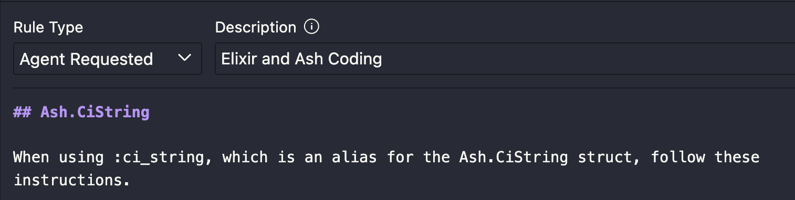

# Introduction

This document contains tips and tricks for optimizing the experience when coding Elixir Phoenix Ash with CursorAI.

## Models

The model that generally provides the best performance as of this writing is Claude Sonnet 4. `Thinking` and `MAX` options (which is significantly more expensive in terms of credits) tend to perform better depending on the prompt.

## MCP Servers

Follow this section to install the Tidewave, Ash-AI, and Playwright (optional) MCP servers.

### Why Playwright?

The optional Playwright MCP server rounds out the feedback loop for coding a web browser application with AI. Its tools let AI inspect the DOM of a running application, view errors in the JavaScript console, click buttons, fill input fields, etc., regardless of the front-end technology, which is probably but not necessarily Phoenix LiveView 🐦‍🔥.

### Prerequisites

1. Tidewave and Ash-AI

Install [`mcp-proxy`](https://github.com/tidewave-ai/mcp_proxy_rust#installation)

2. Playwright (Optional)

Install `npx` by [installing any version of NodeJS](https://nodejs.org/)

### Configuration

1. Select the `Settings/Cursor Settings` item from the `Cursor` menu
2. Click the `Add new global MCP server` button
3. Inspect the following JSON and merge it into your existing configuration:

```json
{
  "mcpServers": {
    "tidewave": {
      "command": "mcp-proxy",
      "args": [
        "http://localhost:4000/tidewave/mcp"
      ]
    },
    "ash": {
      "command": "mcp-proxy",
      "args": ["http://localhost:4000/ash_ai/mcp"]
    },
    "playwright": {
      "command": "npx",
      "args": ["-y", "@executeautomation/playwright-mcp-server"]
    }
  }
}
```

## Rules

Agents can decide which rules to add to the context, based on the prompt. You can assist this selection process by starting prompts with hints, such as "This is an Ash project" and then adding "Ash" to the description of all relevant rules. Therefore, rules are generally best configured as follows:

1. `Rule type`: Agent requested
2. `Description`: Elxir and Ash Coding



You can also manually add rules to each prompt.

Keep the following in mind:

- More input tokens can paradoxically result in worse performance, but, in general, more context is better.
- Although improving, models have limited context windows. More rules means less room for code and other inputs.
- In MAX mode, larger contexts consume additional credits. Follow the "more is better" rule of thumb when it comes to context, but if you're using MAX mode, additional consideration is warranted when it comes to which rules to incorporate for a particular task.
