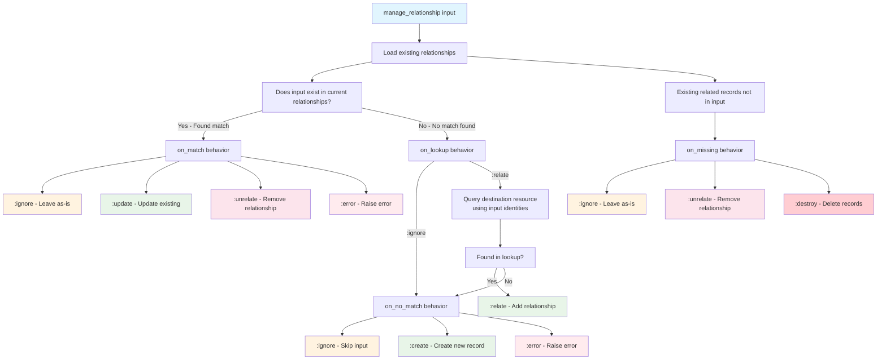

<!--
SPDX-FileCopyrightText: 2019 ash contributors <https://github.com/ash-project/ash/graphs.contributors>

SPDX-License-Identifier: MIT
-->

# Relationships

Relationships describe the connections between resources and are a core
component of Ash. Defining relationships enables you to do things like

- Loading related data
- Filtering on related data
- Managing related records through changes on a single resource
- Authorizing based on the state of related data

## Relationships Basics

A relationship exists between a source resource and a destination resource.
These are defined in the `relationships` block of the source resource. For
example, if `MyApp.Tweet` is the source resource, and `MyApp.User` is the
destination resource, we could define a relationship called `:owner` like this:

```elixir
defmodule MyApp.Tweet do
  use Ash.Resource,
    data_layer: my_data_layer

  attributes do
    uuid_primary_key :id
    attribute :body, :string
  end

  relationships do
    belongs_to :owner, MyApp.User
  end
end
```

## Kinds of relationships

There are four kinds of relationships:

- [`belongs_to`](#belongs-to)
- [`has_one`](#has-one)
- [`has_many`](#has-many)
- [`many_to_many`](#many-to-many)

Each of these relationships has a `source` resource and a `destination` resource
with a corresponding attribute on the source resource (`source_attribute`), and
destination resource (`destination_attribute`). Relationships will validate that
their configured attributes exist at compile time.

You don't need to have a corresponding "reverse" relationship for every
relationship, i.e if you have a `MyApp.Tweet` resource with
`belongs_to :user, MyApp.User` you aren't required to have a
`has_many :tweets, MyApp.Tweet` on `MyApp.User`. All that is required is that
the attributes used by the relationship exist.

### Belongs To

```elixir
# on MyApp.Tweet
belongs_to :owner, MyApp.User
```

A `belongs_to` relationship means that there is an attribute
(`source_attribute`) on the source resource that uniquely identifies a record
with a matching attribute (`destination_attribute`) in the destination. In the
example above, the source attribute on `MyApp.Tweet` is `:owner_id` and the
destination attribute on `MyApp.User` is `:id`.

#### Attribute Defaults

By default, the `source_attribute` is defined as `:<relationship_name>_id` of
the type `:uuid` on the source resource and the `destination_attribute` is
assumed to be `:id`. You can override the attribute names by specifying the
`source_attribute` and `destination_attribute` options like so:

```elixir
belongs_to :owner, MyApp.User do
  # defaults to :<relationship_name>_id (i.e. :owner_id)
  source_attribute :custom_attribute_name

  # defaults to :id
  destination_attribute :custom_attribute_name
end
```

You can further customize the `source_attribute` using options such as:

- `d:Ash.Resource.Dsl.relationships.belongs_to|define_attribute?` to define it
  yourself
- `d:Ash.Resource.Dsl.relationships.belongs_to|attribute_type` to modify the
  default type
- `d:Ash.Resource.Dsl.relationships.belongs_to|attribute_public?` to make the
  source attribute `public?: true`

For example:

```elixir
belongs_to :owner, MyApp.User do
  attribute_type :integer
  attribute_writable? false
end
```

Or if you wanted to define the attribute yourself,

```elixir
attributes do
  attribute :owner_foo, MyApp.CustomType
end

...
relationships do
  belongs_to :owner, MyApp.User do
    define_attribute? false
    source_attribute :owner_foo
  end
end
```

#### Customizing default belongs_to attribute type

Destination attributes that are added by default are assumed to be `:uuid`. To
change this, set the following configuration in `config.exs`:

```elixir
config :ash, :default_belongs_to_type, :integer
```

See the docs for more: `d:Ash.Resource.Dsl.relationships.belongs_to`

### Has One

```elixir
# on MyApp.User
has_one :profile, MyApp.Profile
```

A `has_one` relationship means that there is a unique attribute
(`destination_attribute`) on the destination resource that identifies a record
with a matching unique attribute (`source_resource`) in the source. In the
example above, the source attribute on `MyApp.User` is `:id` and the destination
attribute on `MyApp.Profile` is `:user_id`.

A `has_one` is similar to a `belongs_to` except the reference attribute is on
the destination resource, instead of the source.

`has_one` is specially useful when trying to load only one of a `has_many`. For example, to load the latest tweet.

```elixir
# on MyApp.User
has_many :tweets, MyApp.Tweet

has_one :latest_tweet, MyApp.Tweet do
  sort inserted_at: :desc
end

# then load it
iex> Ash.get!(User, 1, load: [:latest_tweet])
# %User{id: 1, latest_tweet: %Tweet{id: 23}}

```

#### Enforcing Uniqueness

If you are modelling a true one-to-one relationship, you will need to use an identity to create the constraint.

```elixir
# on MyApp.User
has_one :profile, MyApp.Profile

# on MyApp.Profile
belongs_to :user, MyApp.User

identities do
  # Creates a unique constraint on the `user_id` foreign key
  identity :user_id, [:user_id]
end
```

See the [identities guide](/documentation/topics/resources/identities.md) for more.

#### Attribute Defaults

By default, the `source_attribute` is assumed to be `:id`, and
`destination_attribute` defaults to `<snake_cased_last_part_of_module_name>_id`.

See the docs for more: `d:Ash.Resource.Dsl.relationships.has_one`

### Has Many

```elixir
# on MyApp.User
has_many :tweets, MyApp.Tweet
```

A `has_many` relationship means that there is a non-unique attribute
(`destination_attribute`) on the destination resource that identifies a record
with a matching attribute (`source_attribute`) in the source. In the example
above, the source attribute on `MyApp.User` is `:id` and the destination
attribute on `MyApp.Tweet` is `:user_id`.

A `has_many` relationship is similar to a `has_one` because the reference
attribute exists on the destination resource. The only difference between this
and `has_one` is that the destination attribute is not unique, and therefore
will produce a list of related items. In the example above, `:tweets`
corresponds to a list of `MyApp.Tweet` records.

#### Attribute Defaults

By default, the `source_attribute` is assumed to be `:id`, and
`destination_attribute` defaults to `<snake_cased_last_part_of_module_name>_id`.

See the docs for more: `d:Ash.Resource.Dsl.relationships.has_many`

### Many To Many

A `many_to_many` relationship can be used to relate many source resources to
many destination resources. To achieve this, the `source_attribute` and
`destination_attribute` are defined on a join resource. A `many_to_many`
relationship can be thought of as a combination of a `has_many` relationship on
the source/destination resources and a `belongs_to` relationship on the join
resource.

For example, consider two resources `MyApp.Tweet` and `MyApp.Hashtag`
representing tweets and hashtags. We want to be able to associate a tweet with
many hashtags, and a hashtag with many tweets. To do this, we could define the
following `many_to_many` relationship:

```elixir
# on MyApp.Tweet
many_to_many :hashtags, MyApp.Hashtag do
  through MyApp.TweetHashtag
  source_attribute_on_join_resource :tweet_id
  destination_attribute_on_join_resource :hashtag_id
end
```

The `through` option specifies the "join" resource that will be used to store
the relationship. We need to define this resource as well:

```elixir
defmodule MyApp.TweetHashtag do
  use Ash.Resource,
    data_layer: your_data_layer

  postgres do
    table "tweet_hashtags"
    repo MyApp.Repo
  end

  relationships do
    belongs_to :tweet, MyApp.Tweet, primary_key?: true, allow_nil?: false
    belongs_to :hashtag, MyApp.Hashtag, primary_key?: true, allow_nil?: false
  end

  actions do
    defaults [:read, :destroy, create: :*, update: :*]
  end
end
```

It is convention to name this resource
`<source_resource_name><destination_resource_name>` however this is not
required. The attributes on the join resource must match the
`source_attribute_on_join_resource` and `destination_attribute_on_join_resource`
options on the `many_to_many` relationship. The relationships on the join
resource are standard `belongs_to` relationships, and can be configured as such.
In this case, we have specified that the `:tweet_id` and `:hashtag_id`
attributes form the primary key for the join resource, and that they cannot be
`nil`.

Now that we have a resource with the proper attributes, Ash will use this
automatically under the hood when performing relationship operations like
filtering and loading.

See the docs for more: `d:Ash.Resource.Dsl.relationships.many_to_many`

## Loading related data

There are two ways to load relationships:

- in the query using `Ash.Query.load/2`
- directly on records using `Ash.load/3`

### On records

Given a single record or a set of records, it is possible to load their
relationships by calling the `load` function on the record's parent domain. For
example:

```elixir
# user = %User{...}
Ash.load(user, :tweets)

# users = [%User{...}, %User{...}, ....]
Ash.load(users, :tweets)
```

This will fetch the tweets for each user, and set them in the corresponding
`tweets` key.

```elixir
%User{
  ...
  tweets: [
    %Tweet{...},
    %Tweet{...},
    ...
  ]
}
```

See `Ash.load/3` for more information.

### In the query

The following will return a list of users with their tweets loaded identically
to the previous example:

```elixir
User
|> Ash.Query.load(:tweets)
|> Ash.read()
```

At present, loading relationships in the query is fundamentally the same as
loading on records. Eventually, data layers will be able to optimize these loads
(potentially including them as joins in the main query).

See `Ash.Query.load/2` for more information.

### More complex data loading

Multiple relationships can be loaded at once, i.e

```elixir
Ash.load(users, [:tweets, :followers])
```

Nested relationships can be loaded:

```elixir
Ash.load(users, followers: [:tweets, :followers])
```

The queries used for loading can be customized by providing a query as the
value.

```elixir
followers = Ash.Query.sort(User, follower_count: :asc)

Ash.load(users, followers: followers)
```

Nested loads will be included in the parent load.

```elixir
followers =
  User
  |> Ash.Query.sort(follower_count: :asc)
  |> Ash.Query.load(:followers)

# Will load followers and followers of those followers
Ash.load(users, followers: followers)
```

## no_attributes? true

This is really useful when creating customized relationships that aren't joined
with simple attribute matches. For example:

```elixir
has_many :higher_priority_tickets, __MODULE__ do
  no_attributes? true
  # parent/1 in this case puts the expression on this current resource
  # so this is "tickets with priority higher than this ticket"
  filter expr(priority > parent(priority))
end
```

This can also be useful when combined with schema-based multitenancy.
Specifically, if you have a tenant resource like `Organization`, you can use
`no_attributes?` to do things like
`has_many :employees, Employee, no_attributes?: true`, which lets you avoid
having an unnecessary `organization_id` field on `Employee`. The same works in
reverse: `has_one :organization, Organization, no_attributes?: true` allows
relating the employee to their organization.

You can also use `no_attributes? true` with attribute-based multitenancy in the
same situation described above, to avoid an unnecessary second filter. If both
resources have attribute multitenancy configured, they will already be filtered
by `organization_id` by virtue of having set the tenant.

> ### Caveats for using `no_attributes?` {: .warning}
>
> 1.  You can still manage relationships from one to the other, but "relate" and
>     "unrelate" will have no effect, because there are no fields to change.
> 2.  Loading the relationship on a list of resources will not behave as
>     expected in all circumstances involving multitenancy. For example, if you
>     get a list of `Organization` and then try to load `employees`, you would
>     need to set a single tenant on the load query, meaning you'll get all
>     organizations back with the set of employees from one tenant. This could
>     eventually be solved, but for now it is considered an edge case.

## Manual Relationships

Manual relationships allow you to express complex or non-typical relationships
between resources in a standard way. Individual data layers may interact with
manual relationships in their own way, so see their corresponding guides. In
general, you should try to use manual relationships sparingly, as you can do _a
lot_ with filters on relationships, and the `no_attributes?` flag.

### Example

In our Helpdesk example, we'd like to have a way to find tickets

In the `Representative` resource, define a `has_many` relationship as `manual`
and point to the module where it will be implemented.

```elixir
relationships do
  has_many :tickets_above_threshold, Helpdesk.Support.Ticket do
    manual Helpdesk.Support.Ticket.Relationships.TicketsAboveThreshold
  end
end
```

Using Ash to get the destination records is ideal, so you can authorize access
like normal but if you need to use a raw ecto query here, you can. As long as
you return the right structure.

The `TicketsAboveThreshold` module is implemented as follows.

```elixir
defmodule Helpdesk.Support.Ticket.Relationships.TicketsAboveThreshold do
  use Ash.Resource.ManualRelationship
  require Ash.Query

  def load(records, _opts, %{query: query} = context) do
    # Use existing records to limit results
    rep_ids = Enum.map(records, & &1.id)

    {:ok,
     query
     |> Ash.Query.filter(representative_id in ^rep_ids)
     |> Ash.Query.filter(priority > representative.priority_threshold)
     |> Ash.read!(Ash.Context.to_opts(context))
     # Return the items grouped by the primary key of the source, i.e representative.id => [...tickets above threshold]
     |> Enum.group_by(& &1.representative_id)}
  end
end
```

### Reusing the Query

Since you likely want to support things like filtering your relationship when
being loaded, you will want to make sure that you use the query being provided.
However, depending on how you're loading the relationship, you may need to do
things like fetch extra records. To do this, you might do things like

```elixir
def load(records, _opts, %{query: query, ..}) do
  # unset some fields
  fetch_query = Ash.Query.unset(query, [:limit, :offset])

  # or, to be more safe/explicit, you might make a new query, explicitly setting only a few fields
  fetch_query = query.resource |> Ash.Query.filter(^query.filter) |> Ash.Query.sort(query.sort)

  ...
end
```

### Query when loading with strict?: true

When using `Ash.Query.load` or `Ash.load` with the `strict?: true` option, the
query that is provided to the load callback might be configured with a
select-statement that doesn't load the attributes you want to group matching
results by. If your codebase utilizes the strict loading functionality, it is
therefore recommended to use `Ash.Query.ensure_selected` on the query to ensure
the required attributes are indeed fetched.

```elixir

# Here only :id & :priority is set, which will then configure the relationship query to only
# select those attributes
{:ok, rep} = Ash.load(representative, [tickets_above_threshold: [:id, :priority]], strict?: true)

defmodule Helpdesk.Support.Ticket.Relationships.TicketsAboveThreshold do
  use Ash.Resource.ManualRelationship
  require Ash.Query

  def load(records, _opts, %{query: query, actor: actor, authorize?: authorize?}) do
    rep_ids = Enum.map(records, & &1.id)

    {:ok,
     query
     # If this isn't added, representative_id would be set to %Ash.NotLoaded, causing the
     # Enum.group_by call below to fail mapping results to the correct records.
     |> Ash.Query.ensure_selected([:representative_id])
     |> Ash.Query.filter(representative_id in ^rep_ids)
     |> Ash.Query.filter(priority > representative.priority_threshold)
     |> Helpdesk.Support.read!(actor: actor, authorize?: authorize?)
     |> Enum.group_by(& &1.representative_id)}
  end
end
```

### Fetching the records and then applying a query

Lets say the records come from some totally unrelated source, or you can't just
modify the query to fetch the records you need. You can fetch the records you
need and then apply the query to them in memory.

```elixir
def load(records, _opts, %{query: query, ..}) do
  # fetch the data from the other source, which is capable of sorting
  data = get_other_data(data, query.sort)

  query
  # unset the sort since we already applied that
  |> Ash.Query.unset([:sort])
  # apply the query in memory (filtering, distinct, limit, offset)
  |> Ash.Query.apply_to(data)
end
```

## Managing Relationships

Ash provides two primary approaches for managing related data, each suited to
different scenarios:

1. **Using `change manage_relationship/3` in actions** - When input comes from
   action arguments
2. **Using `Ash.Changeset.manage_relationship/4` directly** - When building
   values programmatically in custom changes

### When to Use Which Approach

**Use `change manage_relationship/3` when:**

- Input comes from action arguments (API endpoints, form submissions)
- You want portable logic across different interfaces (GraphQL, JSON API)
- You need standard CRUD operations on relationships
- The relationship management logic is straightforward

**Use `Ash.Changeset.manage_relationship/4` when:**

- Building relationship data programmatically in custom changes
- You need complex logic or data transformation before managing relationships
- Conditional relationship management based on changeset state
- Integration with external APIs or complex business rules

> #### Order of operations {: .warning}
>
> In destroy actions, relationships are managed **after** the main action is
> performed. This means if you're using `manage_relationship` to remove related
> records in a destroy action, and your database has foreign key constraints
> with "no action" or "restrict" settings, you may encounter constraint
> violations because Ash tries to destroy the primary resource first.
>
> To work around this, you can:
>
> - Use the `cascade_destroy` builtin change instead of `manage_relationship`
> - Configure your database constraints to be deferred
> - Use different constraint settings that allow the operation order

### Using `change manage_relationship/3` in Actions

This is the most common approach for managing relationships through action
arguments:

```elixir
actions do
  update :update do
    argument :add_comment, :map do
      allow_nil? false
    end

    argument :tags, {:array, :uuid} do
      allow_nil? false
    end

    # First argument is the name of the action argument to use
    # Second argument is the relationship to be managed
    # Third argument is options. For more, see `Ash.Changeset.manage_relationship/4`.
    change manage_relationship(:add_comment, :comments, type: :create)

    # Second argument can be omitted when argument name matches relationship name
    change manage_relationship(:tags, type: :append_and_remove)
  end
end
```

With this setup, you can use the arguments in action input:

```elixir
post
|> Ash.Changeset.for_update(:update, %{
  tags: [tag1.id, tag2.id],
  add_comment: %{text: "comment text"}
})
|> Ash.update!()
```

#### Common Patterns with Actions

**Creating with related data:**

```elixir
create :create_with_author do
  argument :author, :map, allow_nil?: false
  change manage_relationship(:author, type: :create)
end

# Usage
Post
|> Ash.Changeset.for_create(:create_with_author, %{
  title: "My Post",
  author: %{name: "John Doe", email: "john@example.com"}
})
|> Ash.create!()
```

**Managing many-to-many relationships:**

```elixir
update :manage_categories do
  argument :category_names, {:array, :string}

  change manage_relationship(:category_names, :categories,
    type: :append_and_remove,
    value_is_key: :name,
    on_lookup: :relate,
    on_no_match: :create
  )
end
```

**Different argument and relationship names:**

```elixir
update :assign_reviewer do
  argument :reviewer_id, :uuid
  change manage_relationship(:reviewer_id, :reviewer, type: :append_and_remove)
end
```

### Using `Ash.Changeset.manage_relationship/4` in Custom Changes

For more complex scenarios, you can use `Ash.Changeset.manage_relationship/4`
directly in custom changes:

```elixir
defmodule MyApp.Changes.AssignProjectMembers do
  use Ash.Resource.Change

  def change(changeset, _opts, context) do
    # Get the current user from context
    current_user = context.actor

    # Build relationship data based on business logic
    members = determine_project_members(changeset, current_user)

    # Manage the relationship directly
    Ash.Changeset.manage_relationship(
      changeset,
      :members,
      members,
      type: :append_and_remove,
      authorize?: true
    )
  end

  defp determine_project_members(changeset, current_user) do
    # Complex logic to determine who should be project members
    # based on changeset data and business rules
    # ...
  end
end
```

**Conditional relationship management:**

```elixir
defmodule MyApp.Changes.ConditionalTagging do
  use Ash.Resource.Change

  def change(changeset, _opts, _context) do
    # Only manage tags if certain conditions are met
    if should_auto_tag?(changeset) do
      tags = generate_auto_tags(changeset)

      Ash.Changeset.manage_relationship(
        changeset,
        :tags,
        tags,
        type: :append,
        on_no_match: :create
      )
    else
      changeset
    end
  end
end
```

**Data transformation before relationship management:**

```elixir
defmodule MyApp.Changes.ProcessOrderItems do
  use Ash.Resource.Change

  def change(changeset, _opts, _context) do
    case Ash.Changeset.fetch_argument(changeset, :raw_items) do
      {:ok, raw_items} ->
        # Transform and validate the raw item data
        processed_items =
          raw_items
          |> validate_items()
          |> calculate_pricing()
          |> apply_discounts()

        Ash.Changeset.manage_relationship(
          changeset,
          :items,
          processed_items,
          type: :direct_control
        )

      :error ->
        changeset
    end
  end
end
```

### Management Types and Options

Ash provides several built-in management types that configure common
relationship management patterns:

#### Management Types

**`:append`** - Add new related records, ignore existing ones

```elixir
change manage_relationship(:tags, type: :append)
# Equivalent to:
# on_lookup: :relate, on_no_match: :error, on_match: :ignore, on_missing: :ignore
```

**`:append_and_remove`** - Add new related records, remove missing ones

```elixir
change manage_relationship(:tags, type: :append_and_remove)
# Equivalent to:
# on_lookup: :relate, on_no_match: :error, on_match: :ignore, on_missing: :unrelate
```

**`:remove`** - Remove specified related records

```elixir
change manage_relationship(:tags, type: :remove)
# Equivalent to:
# on_no_match: :error, on_match: :unrelate, on_missing: :ignore
```

**`:direct_control`** - Full CRUD control over the related records

```elixir
change manage_relationship(:comments, type: :direct_control)
# Equivalent to:
# on_lookup: :ignore, on_no_match: :create, on_match: :update, on_missing: :destroy
```

**`:create`** - Only create new related records

```elixir
change manage_relationship(:items, type: :create)
# Equivalent to:
# on_no_match: :create, on_match: :ignore
```

#### Key Options

**`on_lookup`** - How to handle records that might exist elsewhere:

- `:ignore` - Don't look up existing records
- `:relate` - Look up and relate existing records
- `{:relate, :action_name}` - Use specific action for relating

**`on_no_match`** - What to do when no matching record exists:

- `:ignore` - Skip these inputs
- `:create` - Create new records
- `{:create, :action_name}` - Use specific create action
- `:error` - Raise an error

**`on_match`** - What to do when a matching record is found:

- `:ignore` - Leave the record as-is
- `:update` - Update the existing record
- `{:update, :action_name}` - Use specific update action
- `:unrelate` - Remove the relationship
- `:error` - Raise an error

**`on_missing`** - What to do with related records not in the input:

- `:ignore` - Leave them as-is
- `:unrelate` - Remove the relationship
- `:destroy` - Delete the records
- `{:destroy, :action_name}` - Use specific destroy action

#### Decision Flow

The following diagram shows how `manage_relationship` processes input records
using these options:



#### Advanced Options

**`value_is_key`** - Use a specific field as the key when providing simple
values:

```elixir
# Allow using category names instead of IDs
change manage_relationship(:category_names, :categories,
  value_is_key: :name,
  type: :append_and_remove
)
```

**`use_identities`** - Specify which identities to use for lookups:

```elixir
change manage_relationship(:tags,
  type: :append_and_remove,
  use_identities: [:name, :_primary_key]
)
```

**`join_keys`** - For many-to-many relationships, specify join table parameters:

```elixir
change manage_relationship(:categories,
  type: :append_and_remove,
  join_keys: [:priority, :added_by]
)
```

### Relationship Type Considerations

#### belongs_to Relationships

When managing `belongs_to` relationships, you're typically setting a parent:

```elixir
create :create_with_parent do
  argument :parent, :map
  change manage_relationship(:parent, type: :create)
end

# Or relating to existing parent
update :assign_parent do
  argument :parent_id, :uuid
  change manage_relationship(:parent_id, :parent, type: :append_and_remove)
end
```

#### has_one Relationships

For `has_one` relationships, you manage a single related record:

```elixir
update :update_profile do
  argument :profile, :map
  change manage_relationship(:profile, type: :direct_control)
end
```

#### has_many Relationships

With `has_many`, you typically manage collections:

```elixir
update :manage_comments do
  argument :comments, {:array, :map}
  change manage_relationship(:comments, type: :direct_control)
end
```

#### many_to_many Relationships

Many-to-many relationships often involve join table management:

```elixir
update :update_post_tags do
  argument :tags, {:array, :map}

  change manage_relationship(:tags,
    type: :append_and_remove,
    join_keys: [:tagged_at, :tagged_by]
  )
end
```

### Advanced Patterns

#### Multiple manage_relationship Calls

You can call `manage_relationship` multiple times, and they'll be processed in
order:

```elixir
update :complex_update do
  argument :add_tags, {:array, :string}
  argument :remove_tags, {:array, :string}

  change manage_relationship(:add_tags, :tags,
    type: :append,
    value_is_key: :name,
    meta: [order: 1]
  )

  change manage_relationship(:remove_tags, :tags,
    type: :remove,
    value_is_key: :name,
    meta: [order: 2]
  )
end
```

### Argument Types and Value Handling

#### Map and List Inputs

When providing maps or lists of maps, you're providing input for actions on the
destination resource:

```elixir
# Maps become action input
argument :comment, :map
change manage_relationship(:comment, :comments, type: :create)

# Usage:
%{comment: %{text: "Great post!", rating: 5}}
```

#### Simple Value Inputs

You can also provide simple values using `value_is_key`:

```elixir
argument :tag_names, {:array, :string}
change manage_relationship(:tag_names, :tags,
  type: :append_and_remove,
  value_is_key: :name,
  on_lookup: :relate,
  on_no_match: :create
)

# Usage:
%{tag_names: ["elixir", "phoenix", "ash"]}
```

#### Using Existing Records

You can also pass existing record structs directly:

```elixir
# In a custom change
existing_tags = Ash.read!(Tag, actor: actor)
Ash.Changeset.manage_relationship(changeset, :tags, existing_tags, type: :append)
```

> #### Authorization considerations {: .warning}
>
> When you pass existing record structs directly to `manage_relationship`, Ash
> assumes that the actor is already authorized to read those records. This
> bypasses the normal authorization checks that would occur if you had provided
> IDs instead.
>
> If you provide ids/maps, Ash will read the records and properly check
> authorization. Only pass existing record structs when you're certain the actor
> has appropriate read permissions for those records, or authorization is not
> relevant.

### Integration with Tools

The explicit nature of relationship management options enables rich
integrations:

- **AshPhoenix.Form** - Automatically derives nested form structures
- **AshGraphQL** - Generates complex input objects for mutations
- **AshJsonApi** - Creates appropriate API endpoints for relationship management

This works because Ash can determine exactly what actions might be called and
what input is needed based on your `manage_relationship` configuration.

For complete documentation of all available options, see
`Ash.Changeset.manage_relationship/4`.
