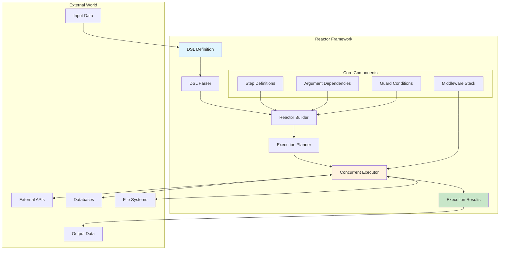

<!--
SPDX-FileCopyrightText: 2023 reactor contributors <https://github.com/ash-project/reactor/graphs.contributors>

SPDX-License-Identifier: MIT
-->

# Reactor Architecture

This guide explains how Reactor works internally, providing insight into its components, execution flow, and design patterns. Understanding the architecture helps you make informed decisions about workflow design, performance optimization, and debugging.

## Core Components

### Architecture Overview

Reactor's architecture follows a clear separation of concerns between planning, execution, and state management:



### The Reactor Struct

At the heart of Reactor is the `Reactor` struct, which contains all the information needed for workflow execution:

```elixir
defstruct context: %{},
          id: nil,
          input_descriptions: %{},
          inputs: [],
          intermediate_results: %{},
          middleware: [],
          plan: nil,
          return: nil,
          state: :pending,
          steps: [],
          undo: []
```

**Key Components:**
- **Context**: Runtime context shared across all steps
- **State**: Reactor lifecycle (`:pending`, `:executing`, `:halted`, `:failed`, `:successful`)
- **Intermediate Results**: Step outputs stored for dependency resolution
- **Undo Stack**: Successful undoable steps tracked for rollback
- **Plan**: The dependency graph once constructed

### DSL Implementation

Reactor's DSL is built with Spark, providing a declarative way to define workflows:

#### DSL Processing Flow

1. **Entity Collection**: DSL entities (steps, inputs, compose) are parsed during compilation
2. **Transformation**: The DSL transformer validates and processes entities:
   - Ensures step names are unique
   - Sets default return value to the last step
   - Plans the reactor at compile-time
3. **Code Generation**: Creates a `reactor/0` function returning the planned struct
4. **Runtime Conversion**: `Reactor.Info.to_struct/1` builds the executable reactor

#### DSL Architecture

```
DSL Definition → Spark Entities → Transformer → Validation → Runtime Struct
```

The transformer ensures reactors are validated and optimised at compile-time, catching errors early and enabling efficient execution.

### Executor Components

The executor system coordinates all aspects of reactor execution through several specialised components:

#### Main Executor (`Reactor.Executor`)

Implements the core execution algorithm with sophisticated async/sync coordination:

**Execution Loop Priority:**
1. Process completed async tasks first (maximum concurrency)
2. Start new async steps (within concurrency limits)
3. Run one sync step if available
4. Handle deadlock prevention for shared pools
5. Check completion conditions

**Key Features:**
- **Concurrency Management**: Respects `max_concurrency` and shared pools
- **Deadlock Prevention**: Runs async steps synchronously when pools exhausted
- **Timeout Handling**: Respects execution timeouts
- **Error Orchestration**: Coordinates undo operations on failure

#### Step Runner (`Reactor.Executor.StepRunner`)

Handles individual step execution with comprehensive error handling:

**Execution Pipeline:**
```
Argument Collection → Context Building → Guard Evaluation → Step Run → Result Processing
```

**Advanced Features:**
- **Subpath Resolution**: Extracts nested values from step results using `result(:step, [:key, :subkey])`
- **Process Metadata**: Maintains execution context in process dictionary for middleware
- **Retry Management**: Tracks retry counts and respects step limits
- **Compensation Handling**: Attempts error recovery when steps support it

#### State Management (`Reactor.Executor.State`)

Runtime-only execution state separate from reactor definition:

```elixir
%State{
  async?: true,
  concurrency_key: nil,
  current_tasks: %{},     # task -> step mapping
  errors: [],             # accumulated errors
  max_concurrency: nil,   # concurrency limit
  retries: %{},          # per-step retry counts
  skipped: MapSet.new()   # steps skipped by guards
}
```

This separation allows the reactor definition to remain immutable while execution state is managed separately.

#### Concurrency Tracker (`Reactor.Executor.ConcurrencyTracker`)

ETS-based global concurrency pool manager enabling resource sharing:

**Architecture:**
- **Pool Allocation**: Creates concurrency pools with configurable limits
- **Atomic Operations**: Uses ETS `select_replace` for thread-safe resource tracking
- **Process Monitoring**: Automatically cleans up pools when allocator processes die
- **Deadlock Prevention**: Enables nested reactor execution without resource exhaustion

**Pool Sharing Benefits:**
- Multiple reactors can share concurrency limits
- Prevents resource exhaustion in nested scenarios
- Enables efficient resource utilisation across reactor hierarchy

### Planner (`Reactor.Planner`)

Converts step definitions into an executable dependency graph:

**Graph Construction Process:**
1. **Vertex Creation**: Each step becomes a graph vertex
2. **Dependency Analysis**: Examines step arguments to identify dependencies
3. **Edge Creation**: Adds directed edges from dependency steps to dependent steps
4. **Cycle Detection**: Validates the graph is acyclic
5. **Ready State**: Identifies steps with no dependencies (ready to run)

**Dependency Types:**
- `input(:name)` - No dependencies (ready immediately)
- `result(:step)` - Depends on named step
- `value(x)` - No dependencies (static values)

The planner uses the [`libgraph`](https://hex.pm/packages/libgraph) library for efficient DAG operations and ensures all dependencies exist before execution begins.

## Execution Flow

### Initialization Phase

**Setup Sequence:**
```
Inputs + Context + Options → State Creation → Pool Allocation → Hook Initialization
```

1. **State Creation**: `Reactor.Executor.Init` builds execution state from options
2. **Pool Management**: Allocates or reuses concurrency pools based on `concurrency_key`
3. **Context Merging**: Combines user context with reactor context
4. **Middleware Setup**: Initialises hooks for telemetry and other cross-cutting concerns

### Main Execution Loop

The executor follows a sophisticated priority-based algorithm designed for maximum concurrency:

```elixir
# Simplified execution loop structure
def execute_loop(reactor, state) do
  state
  |> handle_completed_async_tasks()
  |> start_new_async_tasks()
  |> run_one_sync_step_if_available()
  |> handle_deadlock_prevention()
  |> check_completion_conditions()
  |> continue_or_finish()
end
```

**Execution Priorities:**
1. **Async Task Completion**: Highest priority for maximum throughput
2. **New Async Tasks**: Started when concurrency slots available
3. **Sync Tasks**: Fill gaps when async slots unavailable
4. **Deadlock Prevention**: Forces async tasks to run sync in nested scenarios

### Step Execution Mechanics

Each step follows a detailed execution pipeline:

#### Argument Resolution

```elixir
# Argument types and their resolution
input(:name)                    # → reactor.context.private.inputs
result(:step)                   # → reactor.intermediate_results
result(:step, :key)             # → get_in(intermediate_results, [:step, :key])
result(:step, [:key, :subkey])  # → get_in(intermediate_results, [:step, :key, :subkey])
value(literal)                  # → literal value
```

**Resolution Process:**
- Validates all required arguments are available
- Handles nested data extraction for subpaths
- Applies transformations (extracted as separate steps during planning)
- Builds argument map for step invocation

#### Step Invocation

```elixir
# Step execution with comprehensive error handling
case step.run(arguments, context, step) do
  {:ok, result} -> handle_success(result)
  {:ok, result, new_steps} -> handle_success_with_new_steps(result, new_steps)
  {:error, reason} -> attempt_compensation(reason)
  :retry -> schedule_retry()
  {:halt, reason} -> initiate_graceful_shutdown(reason)
end
```

**Context Building:**
Each step receives enhanced context:
- **Reactor Context**: Shared data and configuration
- **Step Context**: Current step, retry count, concurrency key
- **Process Context**: Middleware-managed async execution context

### Result Processing

#### Success Path

**Result Storage Strategy:**
- Results stored in `intermediate_results` only when needed by:
  - Dependent steps (determined by dependency graph)
  - Reactor return value
- Memory optimisation: unused results are discarded immediately

**Undo Stack Management:**
- Steps with `undo/4` callbacks are added to the undo stack with their results
- Stack maintained in reverse chronological order (LIFO)
- Non-undoable steps save memory by not storing results

**Graph Updates:**
- Completed steps are removed from the dependency graph
- Dependent steps become ready when all dependencies satisfied
- New steps (from `{:ok, result, new_steps}`) are planned and integrated

#### Error Path

**Error Handling Cascade:**
1. **Compensation Attempt**: Call step's `compensate/4` if available
2. **Undo Initiation**: If compensation fails, begin undo cascade
3. **Stack Processing**: Undo steps in reverse order
4. **Error Collection**: Accumulate all errors for final reporting
5. **Resource Cleanup**: Release concurrency slots and clean up tasks

**Compensation Options:**
```elixir
def compensate(reason, arguments, context, step) do
  case reason do
    %RetryableError{} -> :retry              # Try again
    %FallbackError{value: v} -> {:continue, v} # Use fallback
    _other -> :ok                            # Accept failure
  end
end
```

## State Management

### Context Evolution

**Multi-layered Context System:**
```elixir
# Base reactor context
%{
  private: %{
    inputs: %{user_id: 123},           # User inputs
    composed_reactors: #{},            # Composition tracking
    replace_arguments: nil             # Argument transformation
  }
}

# Enhanced step context (merged at runtime)
%{
  current_step: step,
  current_try: 0,
  retries_remaining: 5,
  concurrency_key: #Reference<...>
}
```

**Context Sharing:**
- **Reactor Level**: Shared across all steps in the reactor
- **Step Level**: Step-specific context merged with reactor context
- **Process Level**: Middleware-managed context for async execution

### Memory Management

**Growth Patterns:**
- **Constant**: Step definitions, dependency graph structure
- **Linear**: Intermediate results, undo stack
- **Temporary**: Task mappings, retry counters

**Optimisation Strategies:**
- Results stored only when required by dependencies or return value
- Non-undoable steps excluded from undo stack
- Completed steps removed from graph for garbage collection
- Task mappings cleaned immediately upon completion

### Concurrency State

**Resource Tracking:**
```elixir
# Active task management
current_tasks: %{
  #PID<0.123.0> => %Step{name: :fetch_user},
  #PID<0.124.0> => %Step{name: :process_data}
}

# Concurrency pool state (in ETS)
{pool_key, current_count, max_count}
```

**Thread Safety:**
- All state mutations happen in main executor process
- Concurrency pool uses atomic ETS operations
- Task results collected via message passing
- No shared mutable state between async tasks

## Performance Characteristics

### Concurrency Model

**Bottleneck Analysis:**
1. **Pool Exhaustion**: Limited by `max_concurrency` setting
2. **Dependency Chains**: Sequential dependencies limit parallelisation
3. **Resource Contention**: Shared pools across reactor hierarchy

**Optimisation Features:**
- **Automatic Sizing**: Default pool size based on `System.schedulers_online/0`
- **Pool Sharing**: Multiple reactors share resources efficiently
- **Eager Execution**: Tasks start immediately when dependencies satisfied
- **Priority Scheduling**: Async completion processed first

### Memory Efficiency

**Access Patterns:**
- **Intermediate Results**: O(1) lookup by step name
- **Undo Stack**: O(n) traversal during error handling only
- **Task Management**: O(1) task-to-step mapping
- **Dependency Resolution**: O(1) argument lookup

**Scalability Characteristics:**
- **Linear Growth**: Memory scales with active results and undo stack size
- **Bounded Resources**: Concurrency limits prevent resource exhaustion
- **Efficient Cleanup**: Completed steps removed immediately
- **Network Effects**: Shared pools improve overall system utilisation

### Graph Operations

**Complexity Analysis:**
- **Construction**: O(V + E) where V = steps, E = dependencies
- **Planning**: O(V + E) cycle detection using efficient graph algorithms
- **Execution**: O(1) ready step identification per iteration
- **Updates**: O(1) step completion, O(k) for k new dependencies

**Performance Optimisations:**
- Compile-time planning for DSL-defined reactors
- Incremental planning for dynamically added steps
- Efficient graph library with optimised operations
- Vertex removal enables immediate garbage collection

## Integration Patterns

### Middleware Architecture

**Hook Points:**
- **Reactor Level**: `before_execute`, `after_execute`, `on_error`
- **Step Level**: `before_step`, `after_step`, `on_step_error`
- **Context Management**: Automatic context propagation to async tasks

**Implementation:**
```elixir
reactor "instrumented_workflow" do
  middlewares do
    middleware Reactor.Middleware.Telemetry
  end
end
```

### Composition Model

**Sub-Reactor Integration:**
- Sub-reactors run with shared concurrency pools
- Context propagated from parent to child
- Error handling respects parent reactor's compensation strategy
- Results flow back to parent reactor seamlessly

### Dynamic Workflow Capabilities

**Runtime Step Creation:**
```elixir
def run(arguments, context, step) do
  new_steps = build_steps_based_on_data(arguments.data)
  {:ok, result, new_steps}
end
```

**Integration Process:**
1. New steps planned and validated
2. Dependencies integrated into existing graph
3. Ready steps scheduled immediately
4. Execution continues seamlessly

This architecture enables Reactor to efficiently orchestrate complex, concurrent workflows while maintaining transactional semantics and providing robust error handling capabilities. The design prioritises both performance and reliability, making it suitable for mission-critical applications requiring sophisticated workflow orchestration.
