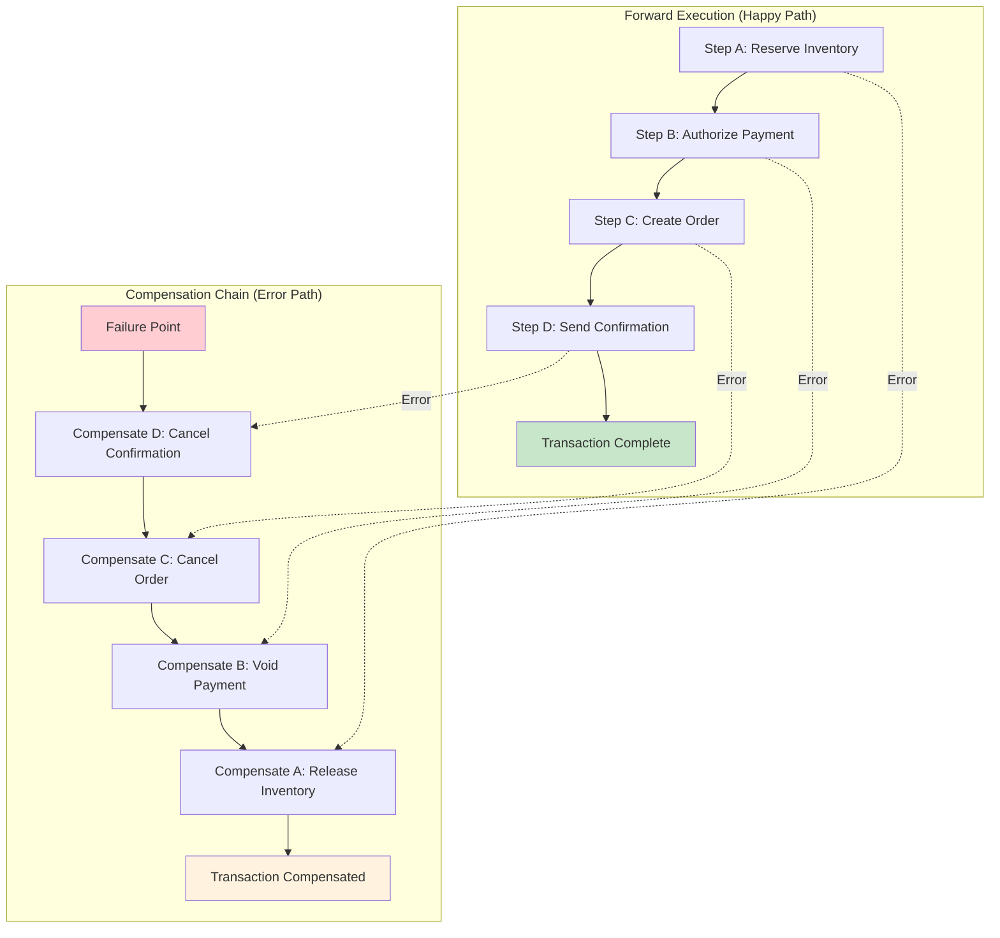

<!--
SPDX-FileCopyrightText: 2023 James Harton, Zach Daniel, Alembic Pty and contributors
SPDX-FileCopyrightText: 2023 reactor contributors <https://github.com/ash-project/reactor/graphs.contributors>

SPDX-License-Identifier: MIT
-->

# Core Reactor Concepts

This guide explains the fundamental concepts that make Reactor work, providing deep insight into how the framework approaches workflow orchestration, error handling, and concurrent execution.

## Sagas and Compensation Patterns

### What is the Saga Pattern?

The Saga pattern provides transaction-like semantics across multiple distinct resources without requiring distributed transactions. Instead of traditional ACID properties, sagas use compensation to handle failures.



In Reactor, each step can optionally implement compensation logic that defines how to handle failures specific to that step's operation:

```elixir
defmodule MyStep do
  use Reactor.Step

  def run(_arguments, _context, _step) do
    # Main step logic that might fail
    {:ok, result}
  end

  def compensate(reason, _arguments, _context, _step) do
    # Handle the failure - can retry, provide fallback, or continue rollback
    case reason do
      %RetryableError{} -> :retry
      %FallbackError{value: value} -> {:continue, value}
      _other -> :ok  # Continue with rollback
    end
  end
end
```

### How Compensation Works

When a step fails, Reactor automatically calls its `compensate/4` callback if it exists. The compensation function can return:

- `:ok` - Accept the failure and continue rollback
- `{:continue, value}` - Provide a replacement result and continue execution
- `:retry` - Retry the failed step (up to `max_retries`)
- `{:error, reason}` - Compensation itself failed

This approach gives each step control over how its failures are handled, enabling sophisticated error recovery strategies.

## Directed Acyclic Graphs (DAGs)

### Dependency Graph Construction

Reactor builds a directed acyclic graph where:
- **Vertices** represent steps
- **Edges** represent dependencies between steps
- **Edge Labels** describe the dependency relationship

Dependencies are created automatically when step arguments reference results from other steps:

```elixir
defmodule UserRegistrationReactor do
  use Reactor

  input :email
  input :password

  step :validate_email do
    argument :email, input(:email)
    run fn %{email: email}, _context ->
      # Validation logic
      {:ok, validated_email}
    end
  end

  step :hash_password do
    argument :password, input(:password)
    # This step can run concurrently with :validate_email
  end

  step :create_user do
    argument :email, result(:validate_email)     # Creates dependency edge
    argument :password, result(:hash_password)   # Creates dependency edge
    # This step waits for both validate_email and hash_password
  end
end
```

### Execution Order Determination

The planner uses the DAG to determine which steps can run:

1. **Ready Steps**: Steps with no unresolved dependencies (no in-edges)
2. **Blocked Steps**: Steps waiting for dependency results
3. **Concurrent Execution**: Multiple ready steps can run simultaneously

This dependency-driven approach maximises concurrency while ensuring correctness.

### Cycle Detection

Reactor validates that the dependency graph is acyclic during planning. Circular dependencies would create deadlocks, so they're detected and reported as errors before execution begins.

The one exception is when a step emits a new step with its own name during execution - this allows for iterative patterns where a step can retry itself or implement loops by re-emitting itself with updated context or arguments.

## Dependency Resolution

### Argument Types

Reactor supports three types of step arguments:

1. **Input Arguments**: `input(:name)` - Values provided when starting the reactor
2. **Result Arguments**: `result(:step_name)` - Outputs from other steps  
3. **Value Arguments**: `value(x)` - Static values defined at build time

### Subpath Access

You can access nested values from step results using subpaths:

```elixir
step :process_user do
  argument :user_id, result(:create_user, :id)        # Extract :id field
  argument :profile, result(:create_user, [:profile, :data])  # Nested access
end
```

### Argument Transformation

Arguments can be transformed before being passed to steps:

```elixir
step :send_email do
  argument :email, result(:validate_email) do
    transform &String.downcase/1
  end
end
```

### Resolution Process

During execution, Reactor resolves arguments by:

1. **Input Arguments**: Looking up values in `reactor.context.private.inputs`
2. **Result Arguments**: Looking up values in `reactor.intermediate_results`
3. **Value Arguments**: Using the literal value provided
4. **Applying Transformations**: If specified, transforming the resolved value

Note that argument transformations are actually extracted into separate transform steps during the planning phase and inserted into the dependency graph. This means transforms become their own steps with proper dependency tracking, rather than being applied inline during argument resolution.

## Concurrency Model

### Async by Default

Steps run asynchronously by default to maximise throughput. This means:

- Multiple steps can execute simultaneously
- The reactor doesn't wait for one step to complete before starting another
- Dependencies still ensure correct execution order

### Concurrency Limits

Reactor uses a concurrency tracker to prevent resource exhaustion:

- **Default Limit**: `System.schedulers_online/0` (number of CPU cores)
- **Shared Pools**: Multiple reactors can share concurrency limits using `concurrency_key`
- **Custom Limits**: Configure per-reactor or globally

### Task Supervision

Async steps run as supervised tasks:

- Each step runs under `Task.Supervisor`
- Failed tasks don't crash the reactor
- Proper cleanup on reactor termination

### Synchronous Execution

Some scenarios require synchronous execution:

- **Explicit**: Set `async? false` on a step
- **Resource Constraints**: When the concurrency pool is exhausted
- **Reactor-Level**: Pass `async? false` when running the entire reactor (often used in tests for deterministic execution)

## Error Handling Philosophy

### Three-Level Error Handling

Reactor implements a sophisticated three-level error handling strategy:

#### 1. Compensation (Step-Level)

When a step fails, its compensation function decides how to handle the failure:

```elixir
def compensate(reason, arguments, context, step) do
  case reason do
    %NetworkError{} -> :retry  # Network issue, try again
    %ValidationError{} -> :ok  # Invalid data, don't retry
    %ServiceUnavailable{fallback: value} -> {:continue, value}  # Use fallback
  end
end
```

#### 2. Undo (Rollback Successful Work)

When compensation can't resolve the error, Reactor undoes previously successful steps:

```elixir
defmodule CreateUserStep do
  def run(arguments, context, step) do
    # Create user in database
    {:ok, user}
  end

  def undo(user, arguments, context, step) do
    # Remove the created user
    Database.delete_user(user.id)
    :ok
  end
end
```

#### 3. Global Rollback

If undo operations fail, the reactor enters a failed state with all error details preserved.

### Undo Stack Management

Reactor maintains an undo stack of successfully completed undoable steps:

- Steps with `undo/4` callbacks are automatically tracked
- Steps are undone in reverse order (last-in-first-out)
- Non-undoable steps are not tracked, saving memory

### Error Classification

Reactor uses the `splode` library to classify errors:

- **Invalid**: Client errors (bad input, validation failures)
- **Internal**: Server errors (bugs, unexpected conditions)  
- **Unknown**: Unclassified errors
- **Validation**: Schema or data validation errors

This classification helps determine appropriate error handling strategies.

### Retry Logic

Steps can be retried automatically:

- **Compensation Return**: Return `:retry` from compensation
- **Retry Limits**: Configure `max_retries` per step (default: 5)
- **Exponential Backoff**: Use `context.current_try` for delay calculation

```elixir
def compensate(reason, arguments, context, step) do
  if context.current_try < step.max_retries do
    # Wait longer each retry
    delay = :math.pow(2, context.current_try) * 1000
    Process.sleep(delay)
    :retry
  else
    :ok  # Give up after max retries
  end
end
```

## Integration Patterns

### Dynamic Step Creation

Steps can create new steps during execution:

```elixir
def run(arguments, context, step) do
  # Process data and determine what steps to create
  new_steps = build_dynamic_steps(arguments.data)
  {:ok, result, new_steps}
end
```

### Middleware Integration

Reactor supports middleware for cross-cutting concerns:

```elixir
reactor "instrumented_workflow" do
  middlewares do
    middleware Reactor.Middleware.Telemetry
  end
  
  # Steps automatically get telemetry events
end
```

### Composition with Sub-Reactors

Complex workflows can be composed from smaller reactors:

```elixir
step :user_onboarding do
  argument :user_data, input(:user)
  compose UserOnboardingReactor
end
```

## Design Principles

These concepts work together based on several key principles:

1. **Dependency-Driven Execution**: Let data dependencies determine execution order
2. **Local Error Handling**: Each step knows best how to handle its own failures
3. **Automatic Rollback**: The system handles cleanup when things go wrong
4. **Concurrent by Default**: Maximise throughput while ensuring correctness
5. **Composable Workflows**: Build complex systems from simple, reusable components

Understanding these concepts provides the foundation for designing effective workflows with Reactor, enabling you to build robust, concurrent, and fault-tolerant systems.
