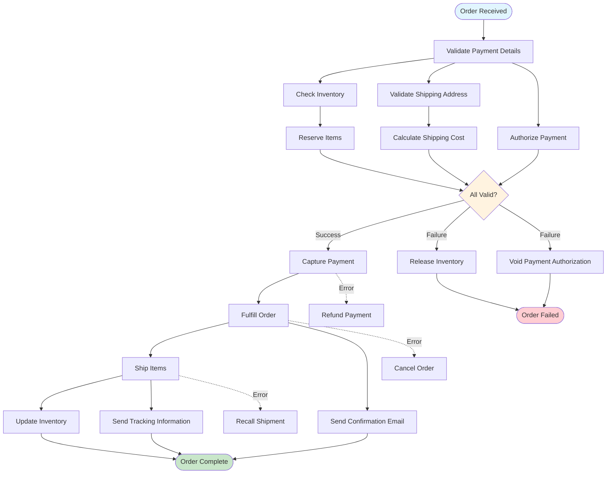

<!--
SPDX-FileCopyrightText: 2023 James Harton, Zach Daniel, Alembic Pty and contributors
SPDX-FileCopyrightText: 2023 reactor contributors <https://github.com/ash-project/reactor/graphs.contributors>

SPDX-License-Identifier: MIT
-->

# How to Build a Payment Processing Workflow

## Problem
You need to coordinate payment authorization, inventory reservation, and order fulfillment with proper rollback on failures. When any step fails, you need to clean up previous successful operations to maintain data consistency.

## Solution Overview
This guide shows you how to build a robust payment processing workflow using Reactor's compensation and undo patterns. You'll learn to handle failures gracefully with automatic rollback.

## Workflow Architecture

Here's the complete payment processing flow with error handling:



## Prerequisites
- Understanding of Reactor basics (inputs, steps, arguments)
- Familiarity with error handling patterns
- Basic knowledge of payment processing concepts

## Complete Working Example

Here's a complete e-commerce payment workflow with proper error handling:

```elixir
defmodule ECommerce.PaymentWorkflow do
  use Reactor

  input :order_id
  input :payment_details
  input :customer_id

  # Step 1: Validate order and check inventory
  step :validate_order, ECommerce.Steps.ValidateOrder do
    argument :order_id, input(:order_id)
  end

  # Step 2: Reserve inventory (can be undone)
  step :reserve_inventory, ECommerce.Steps.ReserveInventory do
    argument :order, result(:validate_order)
  end

  # Step 3: Authorize payment (can be undone)  
  step :authorize_payment, ECommerce.Steps.AuthorizePayment do
    argument :payment_details, input(:payment_details)
    argument :order, result(:validate_order)
    wait_for :reserve_inventory  # Ensure inventory is reserved first
  end

  # Step 4: Capture payment (compensatable)
  step :capture_payment, ECommerce.Steps.CapturePayment do
    argument :authorization, result(:authorize_payment)
    argument :order, result(:validate_order)
  end

  # Step 5: Fulfill order (compensatable)
  step :fulfill_order, ECommerce.Steps.FulfillOrder do
    argument :order, result(:validate_order)
    argument :inventory_reservation, result(:reserve_inventory)
  end

  # Step 6: Send confirmation (basic step, no rollback needed)
  step :send_confirmation, ECommerce.Steps.SendConfirmation do
    argument :order, result(:validate_order)
    argument :customer_id, input(:customer_id)
    argument :payment, result(:capture_payment)
  end

  return :send_confirmation
end
```

## Step Implementations

### 1. Inventory Reservation (Undoable)

```elixir
defmodule ECommerce.Steps.ReserveInventory do
  use Reactor.Step

  @impl true
  def run(%{order: order}, _context, _options) do
    case InventoryService.reserve_items(order.items) do
      {:ok, reservation} -> {:ok, reservation}
      {:error, :insufficient_stock} -> {:error, "Not enough inventory for order"}
      {:error, reason} -> {:error, reason}
    end
  end

  @impl true
  def undo(reservation, _arguments, _context, _options) do
    # Release the reserved inventory if later steps fail
    case InventoryService.release_reservation(reservation.id) do
      :ok -> :ok
      {:error, :already_released} -> :ok  # Already cleaned up
      {:error, reason} -> {:error, reason}
    end
  end
end
```

### 2. Payment Authorization (Undoable)

```elixir
defmodule ECommerce.Steps.AuthorizePayment do
  use Reactor.Step

  @impl true
  def run(%{payment_details: details, order: order}, _context, _options) do
    case PaymentGateway.authorize(details, order.total) do
      {:ok, authorization} -> {:ok, authorization}
      {:error, :card_declined} -> {:error, "Payment was declined"}
      {:error, :insufficient_funds} -> {:error, "Insufficient funds"}
      {:error, reason} -> {:error, reason}
    end
  end

  @impl true 
  def undo(authorization, _arguments, _context, _options) do
    # Void the authorization if fulfillment fails
    case PaymentGateway.void_authorization(authorization.id) do
      :ok -> :ok
      {:error, :already_voided} -> :ok
      {:error, reason} -> {:error, reason}
    end
  end
end
```

### 3. Payment Capture (Compensatable with Retry)

```elixir
defmodule ECommerce.Steps.CapturePayment do
  use Reactor.Step

  @impl true
  def run(%{authorization: auth, order: order}, _context, _options) do
    case PaymentGateway.capture(auth.id, order.total) do
      {:ok, capture} -> {:ok, capture}
      {:error, :network_timeout} -> :retry  # Retry network issues
      {:error, :authorization_expired} -> {:error, "Authorization expired"}
      {:error, reason} -> {:error, reason}
    end
  end

  @impl true
  def compensate(reason, %{authorization: auth}, _context, _options) do
    case reason do
      # Retry on transient network issues
      %PaymentGateway.NetworkError{} -> :retry
      %PaymentGateway.TimeoutError{} -> :retry
      
      # Don't retry on business logic errors
      _other -> :ok
    end
  end
end
```

### 4. Order Fulfillment (Compensatable)

```elixir
defmodule ECommerce.Steps.FulfillOrder do
  use Reactor.Step

  @impl true
  def run(%{order: order, inventory_reservation: reservation}, _context, _options) do
    case FulfillmentService.create_shipment(order, reservation) do
      {:ok, shipment} -> {:ok, shipment}
      {:error, :warehouse_unavailable} -> :retry
      {:error, reason} -> {:error, reason}
    end
  end

  @impl true
  def compensate(reason, _arguments, _context, _options) do
    case reason do
      # Retry warehouse issues
      %FulfillmentService.WarehouseError{} -> :retry
      
      # Don't retry validation errors
      _other -> :ok
    end
  end
end
```

## Running the Workflow

```elixir
# Successful execution
{:ok, confirmation} = Reactor.run(ECommerce.PaymentWorkflow,
  order_id: "order_123",
  payment_details: %{
    card_number: "4111111111111111",
    exp_month: 12,
    exp_year: 2025,
    cvv: "123"
  },
  customer_id: "customer_456"
)

# Handle failures gracefully
case Reactor.run(ECommerce.PaymentWorkflow, invalid_inputs) do
  {:ok, result} -> 
    # Process successful order
    handle_successful_order(result)
    
  {:error, errors} ->
    # Log errors and notify customer
    Logger.error("Payment workflow failed: #{inspect(errors)}")
    notify_customer_of_failure(customer_id, errors)
end
```

## Key Patterns Explained

### Compensation vs Undo

**Undo** is called when a step succeeded but a later step failed:
- Use for cleaning up successful operations (release inventory, void payments)
- Called in reverse order of step execution

**Compensate** is called when the step itself failed:
- Use for retry logic on transient failures
- Return `:retry` to try the step again, `:ok` to continue with failure

### Error Recovery Strategy

```elixir
def compensate(reason, arguments, context, options) do
  case reason do
    # Retry transient failures
    %HTTPoison.Error{reason: :timeout} -> :retry
    %HTTPoison.Error{reason: :econnrefused} -> :retry
    %PaymentGateway.NetworkError{} -> :retry
    
    # Don't retry business logic failures  
    %PaymentGateway.CardDeclinedError{} -> :ok
    %InventoryService.OutOfStockError{} -> :ok
    
    # Default: don't retry unknown errors
    _other -> :ok
  end
end
```

### Dependency Management

Use `wait_for` to control execution order without passing data:

```elixir
step :authorize_payment do
  argument :payment_details, input(:payment_details)
  wait_for :reserve_inventory  # Ensure inventory reserved first
  run &authorize_payment/1
end
```

## Variations

### Multi-Warehouse Fulfillment

```elixir
map :check_warehouses do
  source input(:preferred_warehouses)
  
  step :check_availability do
    argument :warehouse, element(:check_warehouses)
    argument :order, result(:validate_order)
    run &check_warehouse_inventory/1
  end
end

step :select_warehouse do
  argument :availability_results, result(:check_warehouses)
  run &select_best_warehouse/1
end
```

### Multiple Payment Methods

```elixir
switch :payment_method do
  on input(:payment_details, [:type])
  
  matches? &(&1 == :credit_card) do
    step :process_card_payment, CreditCardProcessor do
      argument :details, input(:payment_details)
    end
  end
  
  matches? &(&1 == :paypal) do
    step :process_paypal_payment, PayPalProcessor do
      argument :details, input(:payment_details)
    end
  end
  
  default do
    flunk "Unsupported payment method"
  end
end
```

### Partial Fulfillment

```elixir
step :check_partial_fulfillment do
  argument :order, result(:validate_order)
  argument :inventory, result(:check_inventory)
  
  where fn %{inventory: inventory, order: order} ->
    InventoryService.can_partially_fulfill?(order, inventory)
  end
  
  run &create_partial_fulfillment/1
end
```

## Troubleshooting

### Common issues

**Inventory not released after payment failure:**
- Ensure `ReserveInventory` implements `undo/4` correctly
- Check that `undo` handles already-released reservations gracefully

**Payment captured but order not fulfilled:**
- Implement proper compensation in fulfillment steps
- Consider implementing refund logic for captured payments

For general error handling and retry issues, see [Error Handling Tutorial](../tutorials/02-error-handling.md#common-issues).

### Debugging Tips

Add debug steps to track workflow progress:

```elixir
debug :log_payment_status do
  argument :payment, result(:capture_payment)
  argument :message, value("Payment captured successfully")
end
```

Use telemetry middleware for observability:

```elixir
defmodule ECommerce.PaymentWorkflow do
  use Reactor
  
  middlewares do
    middleware Reactor.Middleware.Telemetry
  end
  
  # ... steps
end
```

## Related Guides

- [Error Handling Tutorial](../tutorials/02-error-handling.md) - Learn compensation basics
- [Testing Strategies](testing-strategies.md) - How to test payment workflows
- [Performance Optimization](performance-optimization.md) - Scaling payment processing
