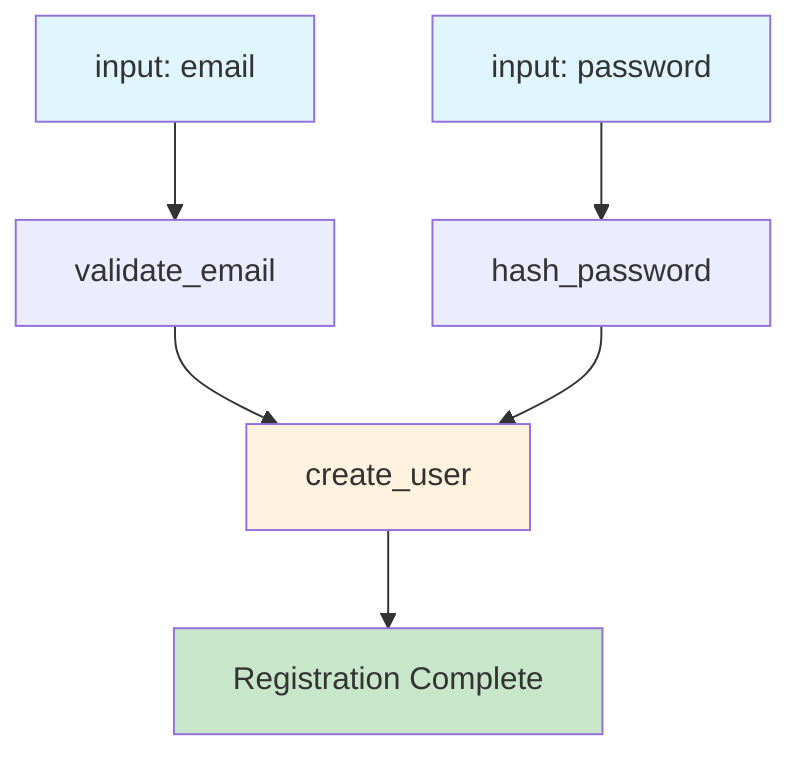

<!--
SPDX-FileCopyrightText: 2023 James Harton, Zach Daniel, Alembic Pty and contributors
SPDX-FileCopyrightText: 2023 reactor contributors <https://github.com/ash-project/reactor/graphs.contributors>

SPDX-License-Identifier: MIT
-->

# Your First Reactor

Welcome to Reactor! In this tutorial, you'll build your first reactor step by step, learning the core concepts through hands-on practice.

## What you'll build

A user registration workflow that validates email, hashes passwords, and creates user records.

## You'll learn

- Defining reactor inputs and steps
- Creating dependencies between steps
- Running reactors and handling results

## Workflow Overview

Here's what we'll build - a simple user registration workflow:



## Prerequisites

- Basic Elixir knowledge
- Igniter New installed: `mix archive.install hex igniter_new`

## Step 1: Create a new project with Reactor

Let's start by creating a new project with Reactor already installed and configured:

```bash
mix igniter.new reactor_tutorial --install reactor
cd reactor_tutorial
```

This creates a new Elixir project and automatically:
- Adds Reactor to your dependencies
- Installs the dependencies
- Sets up any necessary configuration

## Step 2: Your first reactor

Create a new file `lib/user_registration.ex` and define your first reactor:

```elixir
defmodule UserRegistration do
  use Reactor

  # Define what inputs this reactor expects
  input :email
  input :password

  # Define a simple step that validates email
  step :validate_email do
    argument :email, input(:email)
    
    run fn %{email: email}, _context ->
      if String.contains?(email, "@") do
        {:ok, email}
      else
        {:error, "Email must contain @"}
      end
    end
  end

  # Define a step that hashes the password
  step :hash_password do
    argument :password, input(:password)
    
    run fn %{password: password}, _context ->
      hashed = :crypto.hash(:sha256, password) |> Base.encode16()
      {:ok, hashed}
    end
  end

  # Define a step that creates the user
  step :create_user do
    argument :email, result(:validate_email)
    argument :password_hash, result(:hash_password)
    
    run fn %{email: email, password_hash: password_hash}, _context ->
      user = %{
        id: :rand.uniform(10000),
        email: email,
        password_hash: password_hash,
        created_at: DateTime.utc_now()
      }
      {:ok, user}
    end
  end

  # Specify what to return when the reactor completes
  return :create_user
end
```

## Step 3: Understanding your reactor

Before running it, let's understand what you've built:

**Inputs** define the parameters your reactor accepts, like function arguments.

**Steps** are units of work with three key parts:
- **Arguments** specify what data the step needs and where it comes from
- **Run function** performs the actual work
- **Dependencies** are created automatically based on arguments

Notice how `:create_user` depends on results from both `:validate_email` and `:hash_password`. This creates an execution order where the first two steps can run concurrently, then `:create_user` runs after both complete.

**Return** specifies what value the reactor should return when everything succeeds.

## Step 4: Run your reactor

Let's test your reactor! Start an IEx session:

```bash
iex -S mix
```

Now run your reactor:

```elixir
# Test with valid data
{:ok, user} = Reactor.run(UserRegistration, %{
  email: "alice@example.com",
  password: "secret123"
})

IO.inspect(user)
# Should output something like:
# %{
#   id: 1234,
#   email: "alice@example.com", 
#   password_hash: "2BB80D537B1DA3E38BD30361AA855686BDE0EACD7162FEF6A25FE97BF527A25B",
#   created_at: ~U[2024-01-15 10:30:00.123456Z]
# }
```

Try with invalid data:

```elixir
# Test with invalid email
{:error, reason} = Reactor.run(UserRegistration, %{
  email: "not-an-email",
  password: "secret123" 
})

IO.inspect(reason)
# Should output: "Email must contain @"
```

## Step 5: Execution order

Here's something important: Reactor doesn't execute steps in the order you wrote them. Instead, it builds a [dependency graph](../reference/glossary.md#dependency-graph) and runs steps as soon as their dependencies are available.

In your reactor:
1. `:validate_email` and `:hash_password` can run **simultaneously** because they only depend on inputs
2. `:create_user` runs **after both** previous steps complete because it needs their results

This automatic parallelization is one of Reactor's key features - you get concurrent execution without having to think about it!

## What you learned

You've built your first reactor and learned the fundamentals:

- **Inputs** define reactor parameters
- **Steps** contain arguments, run functions, and automatic dependencies
- **Arguments** create execution order by specifying data sources
- **Concurrent execution** happens automatically when steps don't depend on each other
- **Dependencies** determine when steps run, not the order you write them

## What's next

Now that you understand the basics, you're ready to learn more advanced concepts:

- **[Error Handling](02-error-handling.md)** - Learn how to handle failures with compensation and undo
- **[Async Workflows](03-async-workflows.md)** - Explore concurrent processing patterns
- **[Composition](04-composition.md)** - Build complex workflows with sub-reactors

Or explore specific use cases in our How-to Guides section.

For quick syntax reference, see the [Reactor Cheatsheet](reactor-cheatsheet.cheatmd).

Happy building with Reactor! 🚀
